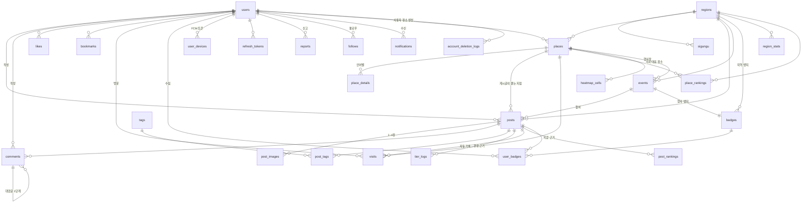

# 데이터 설계

- 기준 엔진: **PostgreSQL 16 + PostGIS 3** ([db-engine-decision.md](db-engine-decision.md))
- 테이블 29개 · 관계 43개 · enum 22개
- 컬럼 단위 정의는 [db-schema.dbml](db-schema.dbml)이 원본이다. [dbdiagram.io](https://dbdiagram.io)에
  붙여넣으면 ERD가 그려진다.
- 요구사항 아이디(`AUTH-001`, `PST-022` 등)는 요구사항 명세서를 가리킨다.

## 설계 규칙

| 규칙 | 내용 |
| --- | --- |
| 시각 | 전부 `timestamptz`. 저장은 UTC, 해석·표시는 Asia/Seoul (SYS-005). 기준일 계산(일일 한도, 방문 1일 1회, 기간별 집계)은 모두 KST 자정 기준 |
| 좌표 | `geography(Point,4326)`. `ST_MakePoint(경도, 위도)::geography`를 **한 곳에서만** 호출한다. TourAPI는 `mapx`가 경도, `mapy`가 위도다 (PLC-005) |
| 삭제 | 전부 soft delete(`status`). 물리 삭제는 배치로만 (SYS-006). 목록 조회 인덱스는 `WHERE status = 'ACTIVE'` 부분 인덱스로 만든다 |
| 카운터 | `*_count`는 조회 성능용 비정규화. 동시성으로 반드시 어긋나므로 매일 새벽 실제 `COUNT`로 덮어쓰는 보정 배치가 필수다 (SYS-007) |
| 멱등 | `INSERT ... ON CONFLICT DO NOTHING`. 복합 PK·UNIQUE 제약이 중복을 막는 1차 방어선이다 (SOC-002, SOC-007, BDG-006, VST-002) |
| 다형 참조 | `likes`, `bookmarks`, `reports`, `notifications`의 `target_type` + `target_id`는 FK를 걸 수 없다. 대상 존재 확인은 애플리케이션이 한다 (CMU-024) |
| 다국어 | UI 문구는 앱이 조립한다. 서버는 완성 문장을 만들지 않고 문구 키와 값만 준다 (NTF-009). 사용자 작성 글은 원문과 `original_language_code`를 보존하고 번역은 후속 확장 (SYS-010) |

## 관계도



## 테이블 목록

### 계정 · 소셜

| 테이블 | 역할 | 관련 요구사항 |
| --- | --- | --- |
| `users` | 회원. 구글 OAuth 단일. `role`은 회원 등급이 아니라 관리자 권한 구분 | AUTH-001, AUTH-014, USER-015, USER-023, PST-032 |
| `user_devices` | 기기별 FCM 토큰. 앱 시작마다 갱신 | USER-007, NTF-010 |
| `refresh_tokens` | 리프레시 토큰 해시. 1회용 회전 | AUTH-008, AUTH-009 |
| `account_deletion_logs` | 탈퇴 감사 기록 | USER-015, USER-016, USER-019 |
| `follows` | 팔로우 관계. 복합 PK가 멱등을 보장 | SOC-002, SOC-007 |

### 장소

| 테이블 | 역할 | 관련 요구사항 |
| --- | --- | --- |
| `regions` | 17개 시도 마스터. `area_code` 단독 PK | PLC-001, MAP-006, PLC-022 |
| `sigungu` | 시군구 마스터. `(area_code, sigungu_code)` PK | PLC-002, PLC-020 |
| `places` | 관광지(OFFICIAL) + 사용자 장소(USER) 통합 | PLC-003, PLC-005, PLC-014, PLC-022 |
| `place_details` | 장문 컬럼 분리. 언어별 행 | PLC-006, SYS-012, SYS-018 |

### 게시글 · 커뮤니티

| 테이블 | 역할 | 관련 요구사항 |
| --- | --- | --- |
| `posts` | 게시글. 장소 필수, 신뢰등급은 서버가 판정 | PST-002, PST-016, PST-022, PST-038 |
| `post_images` | 사진 1~4장. 비율은 메이슨리 카드 높이 계산용 | PST-001, PST-021 |
| `tier_logs` | 신뢰등급 판정 근거 감사 로그 | PST-028, PST-047 |
| `comments` | 댓글. 대댓글 깊이 1단계 | CMU-014, CMU-015, CMU-017 |
| `likes` | 좋아요(게시글·댓글) | PST-040, CMU-018 |
| `bookmarks` | 저장함(게시글·장소) | CMU-023, PLC-015 |
| `tags` | 해시태그 마스터. `theme_code`가 테마 랭킹 키 | CMU-025, RNK-005 |
| `post_tags` | 게시글-태그 연결. 고정 태그는 `is_locked` | PST-004, EVT-018, CMU-032 |

### 이벤트 · 뱃지 · 방문

| 테이블 | 역할 | 관련 요구사항 |
| --- | --- | --- |
| `events` | 행사. 고정 태그와 인증 반경 | EVT-001, EVT-017, EVT-023 |
| `badges` | 수집형 뱃지 정의. 획득 조건은 `condition_json` | BDG-001, BDG-007, BDG-009 |
| `user_badges` | 획득 기록. 행의 존재가 곧 획득 | BDG-006, BDG-014 |
| `visits` | 방문 기록. 같은 날 같은 장소 1회 | VST-001, VST-002, PST-039 |

### 집계 · 알림 · 운영

| 테이블 | 역할 | 관련 요구사항 |
| --- | --- | --- |
| `heatmap_cells` | 히트맵 격자 집계. 기간별로 행이 분리된다 | MAP-008~012, MAP-022 |
| `region_stats` | 지역 레이어 버블용 집계 | MAP-005 |
| `place_rankings` | 장소 랭킹 스냅샷 | RNK-002, RNK-007, RNK-008 |
| `post_rankings` | 게시글 인기 점수 스냅샷 | CMU-008, PST-035 |
| `notifications` | 인앱 알림. 문구는 키와 값만 | NTF-008, NTF-009, NTF-011 |
| `reports` | 신고. 동일 대상 중복 불가 | PST-043, PST-044 |
| `sync_logs` | 외부 연동 배치 실행 기록 | PLC-008, PLC-009 |
| `search_logs` | 인기 검색어 집계용 | SCH-010 |

## 핵심 설계 판단

### 시도와 시군구를 나눈 이유

`regions` 하나에 `area_code`와 `sigungu_code`를 넣고 복합 PK로 두면, `area_code` 하나만 참조하는
8개 테이블(`places`, `posts`, `events`, `badges`, `region_stats`, `place_rankings`, `sync_logs`,
`search_logs`)의 외래키가 성립하지 않는다. 유일하지 않은 컬럼을 가리키게 되기 때문이다.
요구사항도 원래 둘을 나눠 놓았다 — PLC-001은 시도 마스터, PLC-002는 시군구 마스터다.

`sigungu_code`는 시도 안에서만 유효한 번호다. "1번 시군구"는 경기도와 강원도에서 서로 다른 곳이다.
그래서 `sigungu`의 PK가 `(area_code, sigungu_code)` 복합이다. TourAPI의 `areaCode`는 1~8, 31~39로
비연속인데 우리가 다시 번호를 매기지 않는다.

### 관광지와 사용자 장소를 한 테이블에 둔 이유

나누면 주변 검색이 `UNION` 두 개가 되어 정렬·페이징이 어려워지고, 히트맵과 지도 마커도 전부
`UNION`이 되며, `posts.place_id`가 어느 테이블의 FK인지 모호해진다. `place_type` 필터 하나로
해결된다. `content_id`에 UNIQUE를 걸었지만 NULL은 UNIQUE 제약을 받지 않으므로 사용자 장소를
얼마든지 넣을 수 있다 — 이게 통합이 성립하는 기술적 근거다.

### `tier_logs`를 `posts`에 합치지 않은 이유

신뢰등급은 게시 시점에 한 번 판정되고 이후 수정할 수 없다(PST-037). 그래서 이력 테이블이
없어도 동작한다. 그럼에도 분리해 둔 근거는 두 가지다.

1. **PST-028** — 판정 근거를 심사에서 검증 자료로 쓴다. 판정 입력값만이 아니라 *그때 적용된 기준*
   (`applied_radius_m`, `threshold_high_minutes`, `threshold_medium_days`)까지 스냅샷으로 남겨야
   나중에 인증 반경이 바뀌어도 판정을 재현할 수 있다. 반경은 관리자가 장소별로 바꿀 수 있고
   (PLC-022) 이벤트 기본값도 지역별로 재정의될 예정이다.
2. **SYS-018** — `posts`는 피드·히트맵·랭킹이 모두 때리는 핫패스인데 판정 근거 컬럼은 목록
   조회에서 한 번도 쓰이지 않는다.

`decided_at`은 `created_at`의 중복이 아니다. "촬영 후 며칠 지났는가"를 계산할 때 기준으로 삼은
시각이며, `taken_at`과 짝으로 있어야 판정이 재현된다.

### `visits`를 `posts`에서 파생하지 않는 이유

`SELECT DISTINCT user_id, place_id, DATE(created_at) FROM posts WHERE tier IN ('HIGH','MEDIUM')`으로
계산할 수 있어 보이지만 세 군데서 막힌다.

1. **PST-039** — "게시글을 지워도 방문 기록과 이미 받은 뱃지는 남긴다." 파생하면 삭제된 행이
   남아 있다는 사실에 의존하게 되고, 실제로 파기하는 순간 방문 사실이 사라진다.
2. **VST-002** — 요구사항이 "DB 유니크 제약으로 보장한다"고 명시한다. 같은 장소에 하루 3개까지
   올릴 수 있으므로(PST-030) 중복 위험이 실재하는데 파생 집계로는 제약을 걸 수 없다.
3. 방문 지도·완주 뱃지·랭킹 방문자 가중치가 매번 `posts`를 `DISTINCT` 집계하지 않아도 된다.

같은 이유로 `visits.post_id`와 `user_badges.source_post_id`는 `ON DELETE SET NULL`이다.
`CASCADE`면 PST-039가 깨진다.

`tier_logs`와 판단이 갈리는 지점은 카디널리티(1:1 vs N:1)와 수명(게시글과 함께 소멸 vs 존속)이다.

### 뱃지 획득 여부에 boolean을 두지 않는 이유

`user_badges`에 행이 있으면 획득, 없으면 미획득이다. boolean 컬럼으로 관리하려면 (전체 사용자 x
전체 뱃지) 조합을 미리 만들어야 하고, 뱃지를 추가할 때마다 전 사용자에게 행을 뿌려야 해서
BDG-007("행사가 늘 때마다 배포할 수는 없다")과 충돌한다. 또 BDG-006의 "DB 유니크 제약으로
보장한다"가 UPDATE 동시성 문제로 바뀐다.

미획득도 회색으로 보여주는 수집함(BDG-009, BDG-010)은 조인 한 번으로 해결된다.

```sql
SELECT b.badge_id, b.name_ko, b.description, ub.earned_at   -- NULL이면 회색
  FROM badges b
  LEFT JOIN user_badges ub
    ON ub.badge_id = b.badge_id AND ub.user_id = :me
 WHERE b.is_obtainable = TRUE;
-- 진행률 = COUNT(ub.earned_at) / COUNT(*)
```

`badges.is_obtainable`은 뱃지 자체의 전역 활성 여부이고 획득 여부(사용자별)와는 다른 축이다.
기간이 끝난 행사 뱃지는 분모에서 빠지지만 이미 받은 사람의 `user_badges` 행은 남는다.

### `badges.condition_json`

BDG-007. 허용하는 `type`은 아래 네 가지로 고정한다.

```json
행사(EVENT)       {"type": "EVENT_PARTICIPATE"}                  // 대상은 badges.event_id
지역(AREA)        {"type": "AREA_POST_COUNT", "threshold": 5}     // 대상 시도는 badges.area_code
완주(COMPLETION)  {"type": "VISITED_AREA_COUNT", "threshold": 17}
기록(RECORD)      {"type": "TOTAL_POST_COUNT", "threshold": 10}
```

평가기는 `type`별 분기를 갖고 파라미터만 데이터로 읽는다. `type`을 새로 늘릴 때만 배포가 필요하고
행사·지역 뱃지 추가는 데이터 입력으로 끝난다. 조건 평가 시 낮음 등급 게시글은 제외한다(PST-026).

### 히트맵 `period`는 집계 주기가 아니다

`heatmap_cells.period`는 **집계 대상 기간**이고 사용자가 화면에서 고르는 필터다(MAP-011).
같은 격자라도 "최근 1시간에 5장"과 "이번 주에 380장"은 다른 숫자이므로 격자 하나당 기간마다
한 행이 있다.

| 값 | 뜻 | 화면 라벨 |
| --- | --- | --- |
| `LAST_1H` | 최근 1시간 | 실시간 |
| `LAST_24H` | 최근 24시간 | 최근 24시간 |
| `WEEKLY` | 최근 7일 | 주간 (기본 선택값) |
| `MONTHLY` | 최근 30일 | 월간 |

네 값 모두 조회 시점에서 거꾸로 세는 **롤링 윈도우**다. 자정 기준이 아니므로 자정 직후에도
비지 않는다. `LAST_1H`가 기준치 미만이면 `LAST_24H`로 폴백한다(MAP-014).

집계 **주기**(`LAST_1H` 1분, 그 외 10분)는 배치 스케줄이고 스키마에는 없다. 마지막 실행 시각만
`calculated_at`에 남는다.

### 게시글 인기 점수를 별도 테이블에 둔 이유

`place_rankings`는 장소 랭킹이라 게시글 인기를 담을 수 없다. RNK-002 비고가 "조회 시 계산 금지"를
명시하므로 `post_rankings`에 미리 계산해 둔다. 다만 팔로잉 가중치(CMU-009)는 사용자별이라
미리 계산할 수 없으므로 `score`를 기준값으로 두고 조회 시 보정한다.

### 알림 중복 방지 키

```sql
UNIQUE (recipient_id, actor_id, type, target_type, target_id)
```

- `POST_LIKE` — `target_id = post_id` → 좋아요를 껐다 켜도 알림 1회
- `FOLLOW` — `target_id = actor의 user_id` → 팔로우/언팔로우 반복에도 1회
- `BADGE_EARNED` — `target_id = badge_id`

키 하나로 세 요구를 만족한다. `target_id`에 무엇을 넣느냐가 설계 포인트다.

## 인덱스

| 인덱스 | 종류 | 대상 쿼리 |
| --- | --- | --- |
| `gix_places_geom` | GIST | 주변 탐색·지도 마커. `ST_DWithin(geom, :point, :radius_m)` (MAP-026, MAP-030) |
| `gin_places_title` | GIN (pg_trgm) | 장소명 한글 부분어 검색. `LIKE '%경복%'`도 인덱스를 탄다 (SCH-004) |
| `idx_places_area_type` | B-tree | 지역·타입별 장소 목록 (PLC-011) |
| `idx_posts_area_created` | B-tree 부분 | 지역 커뮤니티 최신순. `WHERE status = 'ACTIVE'` |
| `idx_posts_place` / `idx_posts_user` | B-tree | 장소 상세의 게시글, 프로필 그리드 |
| `idx_follows_following` | B-tree | 팔로워 목록. PK(follower, following)만으로는 이 방향을 못 탄다 (SOC-010) |
| `uk_visits_daily` | UNIQUE | 같은 날 같은 장소 중복 차단 (VST-002) |
| `uk_notifications_dedup` | UNIQUE | 알림 중복 방지 (NTF-008) |
| `idx_notifications_unread` | B-tree 부분 | 안읽은 알림 배지. `WHERE is_read = false` (NTF-012) |
| `uk_heatmap_cell` | UNIQUE | 히트맵 배치 UPSERT |

복합 인덱스는 왼쪽부터 순서대로 써야 탄다.

## 미결정 사항

| 요구사항 | 정할 것 |
| --- | --- |
| MAP-025 | `heatmap_cells`에 썸네일 URL 배열을 둘지. 없으면 마커를 그릴 때 `posts`·`post_images` 조인이 생겨 "미리 저장해 바로 그린다"는 취지가 깨진다 |
| SCH-011, VST-006 | 최근 검색어·최근 본 장소를 앱 로컬 / Redis / DB 중 어디에 둘지. 현재 스키마에는 없다 |
| RNK-013 | 추천할 것이 없을 때 쓰는 운영자 지정 장소 목록. `places.is_curated` 정도 |
| PST-043, PLC-023 | 신고 대상 범위. 요구사항 근거는 게시글·장소뿐인데 `report_target`은 댓글·사용자까지 열어 두었다. 댓글 신고를 넣으면 `comment_status`에 `BLINDED`도 추가해야 한다 |
| BDG-013 | `badges.earned_count`. 다른 카운터는 전부 비정규화했으므로 여기만 `COUNT`면 일관성이 깨진다 |
| CMU-019 | 공개 공유 주소에 `post_id`를 그대로 노출할지, `posts.share_slug`를 둘지 |

## 규모 예상

| 테이블 | 예상 건수 | 비고 |
| --- | --- | --- |
| `places` (OFFICIAL) | 3만~5만 | TourAPI 6개 타입 전체 |
| `places` (USER) | 수백~수천 | 하루 5개 제한 (PLC-018) |
| `posts` | 수천~수만 | 공모전 기간 |
| `post_images` | posts x 1~4 | |
| `visits` | posts와 비슷 | 하루 1회 제한 |
| `notifications` | 가장 빨리 늘어난다 | 90일 후 삭제 배치 필수 (NTF-014) |
| `heatmap_cells` | 4레벨 x 4기간 x 격자수 | UPSERT라 고정적 |

이 규모에서는 PostgreSQL 단일 인스턴스로 충분하다. 병목이 생기면 거의 확실히 인덱스 누락이거나
N+1 쿼리다.
